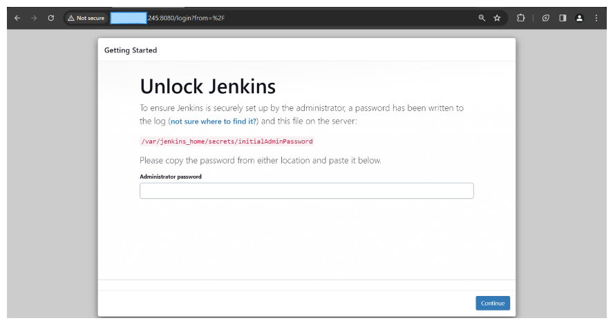
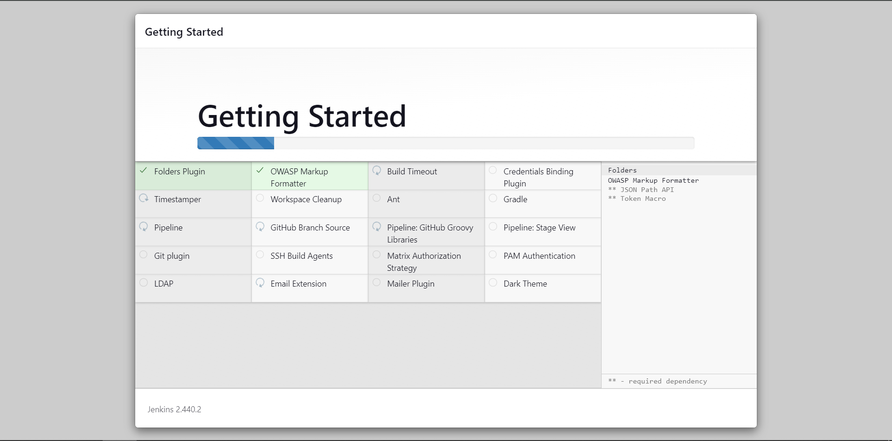
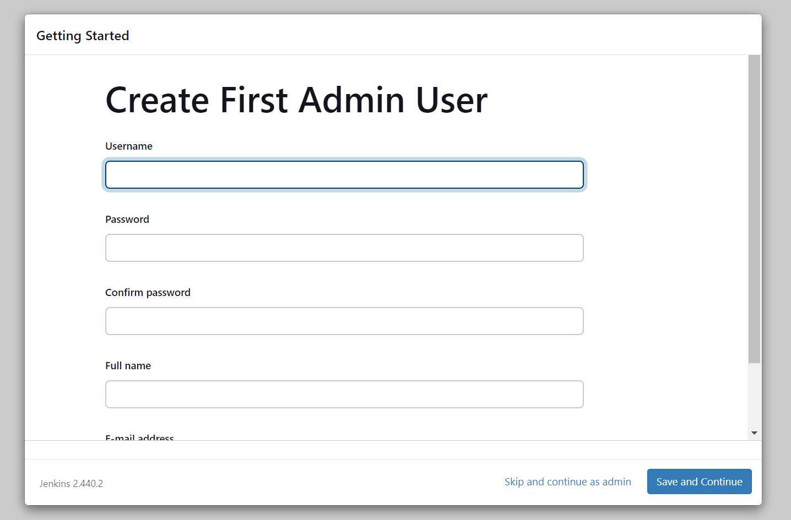
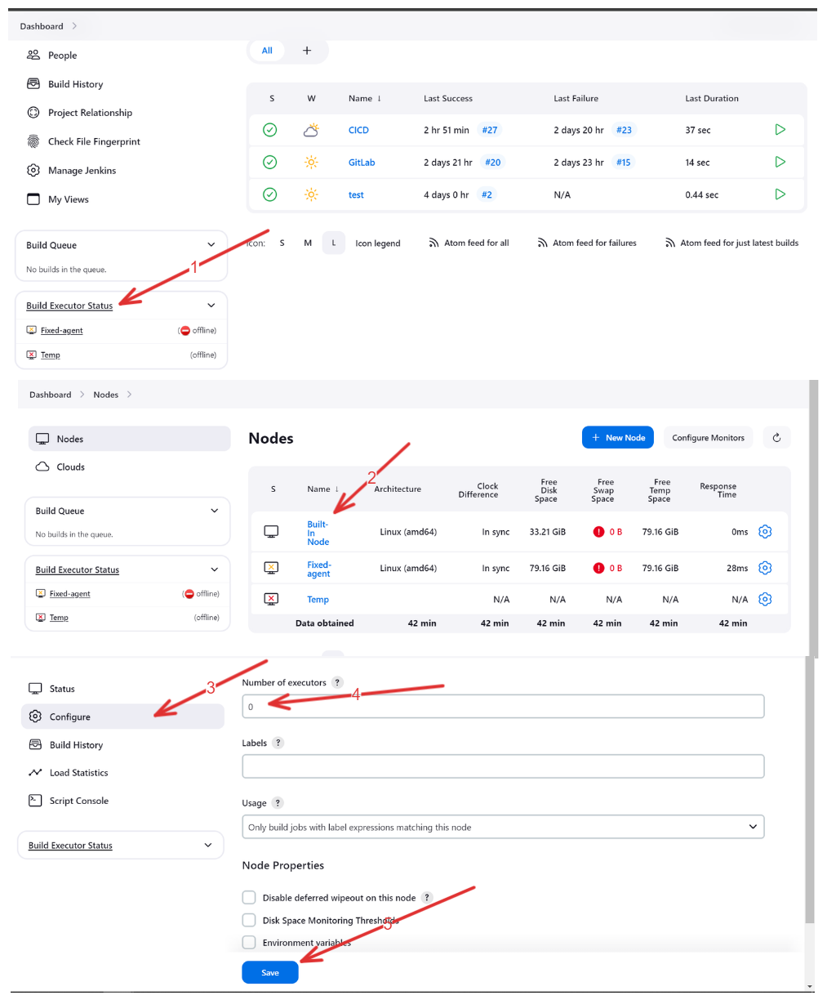
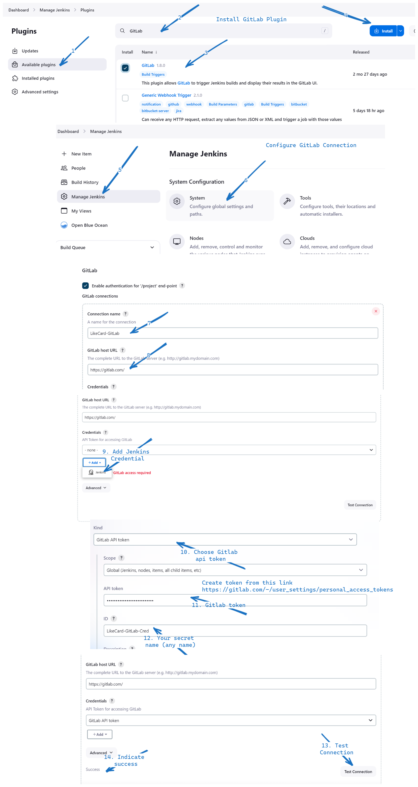
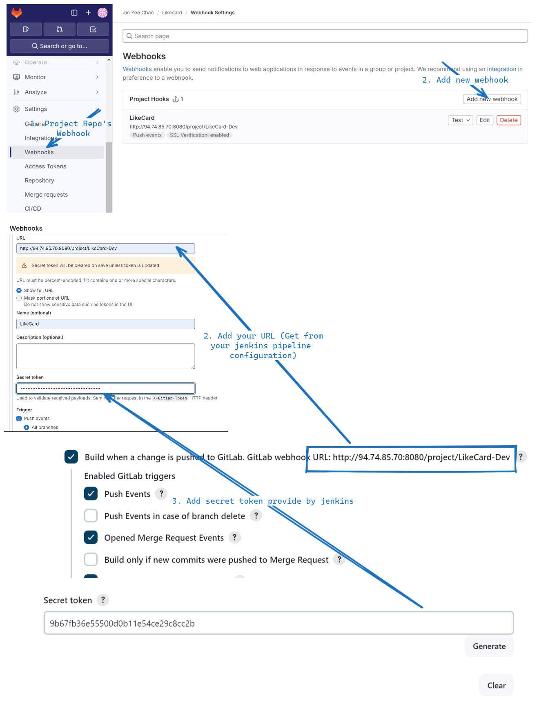

# Step By Step Jenkins CI/CD Guide with Huawei Cloud ECS. (TLDR...)
1.	Programming language or framework to used is (.Net)
2.	CI/CD tool will be used (Jenkins)
3.	Source control management tool (GitLab)
4.	CI/CD environment (ECS)
5.	Application Environment (ECS)
6.	Special Request toward CICD pipeline
  -	Need to get manual approval before deploy to production environment
  -	Store the build artifact for each build. 

## 1. Infrastucture
Prepare related infrastucture using terraform
```bash
export HW_ACCESS_KEY="2EHGMJTTJBTWTK1JIZKA"
export HW_SECRET_KEY="<- Your Huawei Secret Key ->"
export PROJECT_ID="0"
export PASSWORD="<- Your ECS password, will used for SSH ->"

terraform init
TF_VAR_secret_key=$HW_SECRET_KEY TF_VAR_access_key=$HW_ACCESS_KEY TF_VAR_password=$PASSWORD TF_VAR_project_ID=$PROJECT_ID terraform apply
```

## 2. Jenkins Deployment
```bash
#1. Install docker 
dnf install docker
systemctl start docker

#2. Deploy Jenkins To Docker
docker run --name jenkins-blueocean --restart=on-failure --detach \
  --volume jenkins-data:/var/jenkins_home \
  --volume /var/run/docker.sock:/var/run/docker.sock \
  --privileged \
  --user=root --publish 8080:8080 --publish 50000:50000 jenkins/jenkins:lts-jdk17

# 3. Get "first time login" password
docker exec jenkins-blueocean cat /var/jenkins_home/secrets/initialAdminPassword

# 4. Copy the password to your jenkins browser.
# 5. Install default plugin
# 6. Create first admin user
```





## Jenkins Agent 
First, we will turn off of using node executor, which this action will not allow to run pipeline together with Jenkins application, instead we will run pipeline on isolate environment call agents which we will configure in next few step. This is the best practice recommended by Jenkins to improve security measure.

To turn off node executor follow below figure. 


Then we need to create agent to run pipeline. First, we need to install relative Jenkins plugin.Follow step from below figure.


Then, we need to configure our agent. There are some important note before you follow below guide, the official image used as agent may have problem. You need to create your own image. Follow the below guide before going to the figure.
```
cd jenkins-agent
docker build -t swr.ap-southeast-3.myhuaweicloud.com/test-fq/jenkins-agent:latest .
docker push swr.ap-southeast-3.myhuaweicloud.com/test-fq/jenkins-agent:latest
```


```bash
# Agent Mounts
type=bind,src=/var/run/docker.sock,dst=/var/run/docker.sock
type=bind,src=/usr/bin/docker,dst=/usr/bin/docker
```

## Pipeline Creation.
We have two requirement during pipeline design, first is store the dotnet artifact and request for approval before make deployment to production.

Before we create the pipeline, we first need to interconnect GitLab with this pipeline. Follow the figure below to perform this configuration.



Then you can start creating your first pipeline. Remember the pipeline also need to connect to your gitlab repository. Follow the figure below.


Then you need to configure your gitlab repo on how to trigger the pipeline when there is commit. Follow below figure.



Before proceeds, I will roughly talk about what the pipeline does. The pipeline will clone the latest push commit from GitLab, build the image, push to docker registry (SWR) then deploy to environment according to approval. Lastly, since my gitlab repository is in private mode, so I need to add credential to login to gitlab also.

Then we need to configure the credentials used in Jenkinsfile include docker registry credential and build name. Below is the figure we needed.


Demo.CICD-Build-Name: swr.ap-southeast-3.myhuaweicloud.com/test-fq/likecard-demo
Demo.CICD-SWR-AK: <- Your HW access key get from HW cloud console ->
Demo.CICD-SWR-SK: <- Follow below instruction ->
```bash
printf "Huawei Access Key Here (Get From Console)" | openssl dgst -binary -sha256 -hmac "Huawei Secret Key Here (Get From Console)" | od -An -vtx1 | sed 's/[ \n]//g' | sed 'N;s/\n//'
```

Then you can make a commit in your gitlab to check your pipeline execution. That all for this, thank you.

## Email Notification configuration
Ref: https://www.youtube.com/watch?v=pAOJ9k2o67Q


